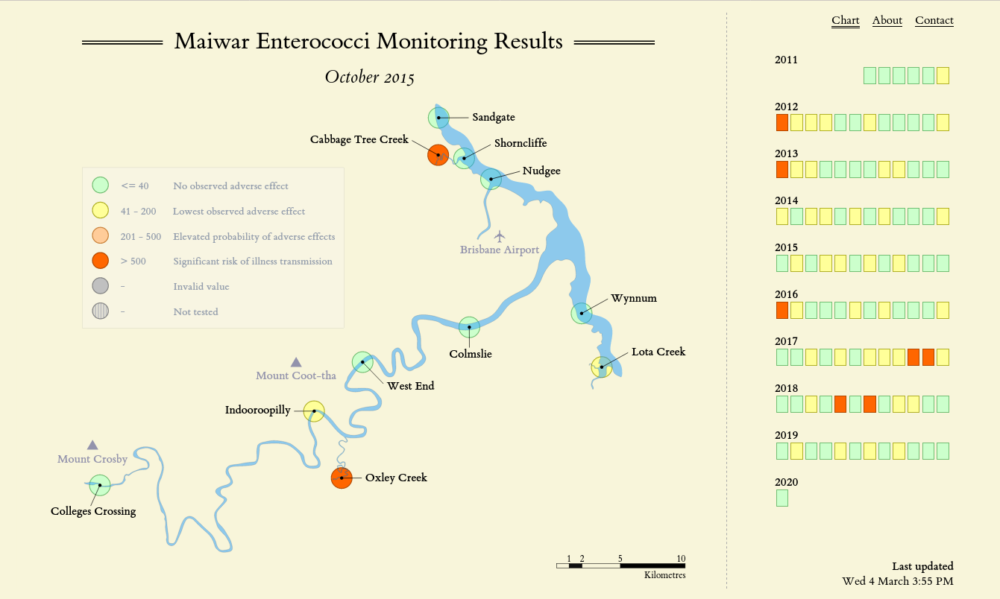

# maiwar-wq

A map displaying the water quality of Maiwar (the Brisbane River) over time.

Check it out at https://eightytwo.net/maiwar-wq/.

This project provides a way to view the water quality of Maiwar on a map from 2011 to the present day. The data is sourced from a [publicly available spreadsheet](https://www.brisbane.qld.gov.au/clean-and-green/natural-environment-and-water/water/water-quality-monitoring) which lists measurements taken monthly (and sometimes twice monthly) from a variety of locations along the river. The water samples taken are tested for Enterococci and the measurement values are Colony Forming Units per 100 ml of water (CFU 100 ml-1).

In this project, the [collector](/collector) program reads the measurement data from the spreadsheet and outputs JSON which can then be processed and displayed by the [website](/site). There are two versions of the collector, one written in Racket and the other in Python. These programs are equivalent and the Racket version was written as an exercise in learning the language.
